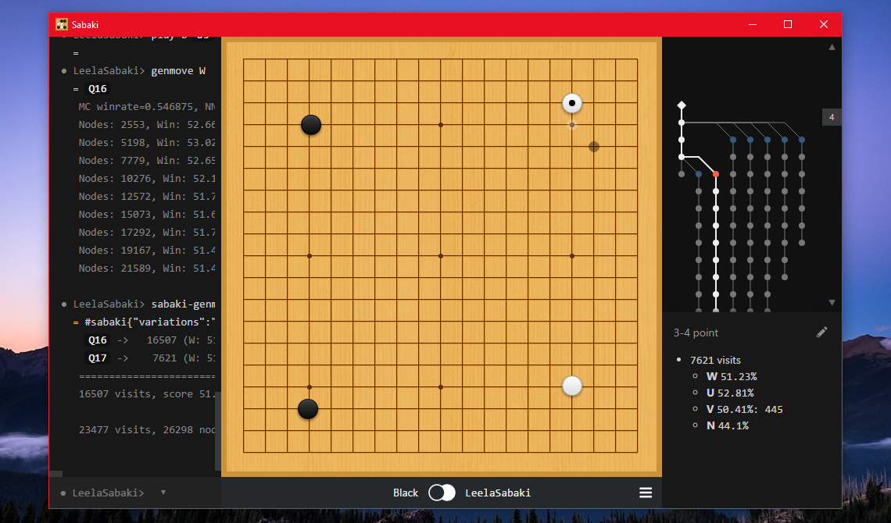

# LeelaSabaki

[Leela (Zero)](https://www.sjeng.org/leela.html) integration with [Sabaki](http://sabaki.yichuanshen.de).

## Features

- Adds other variations considered by Leela (Zero) to the game tree in Sabaki, along with winning statistics

## Installation

- Make sure you have the engine only version of [Leela](https://www.sjeng.org/leela.html) or [Leela Zero](https://github.com/gcp/leela-zero).
- Make sure you have [Sabaki v0.32.1 beta](https://github.com/yishn/Sabaki/releases/tag/v0.32.1) installed.
- [Download LeelaSabaki](https://github.com/yishn/LeelaSabaki/releases), or [build it yourself](#building). Make sure you have permission to execute the files.
- Open Sabaki and open the 'Preferences' drawer by pressing <kbd>Ctrl+,</kbd> or <kbd>Cmd+,</kbd>.
- Click on the 'Engines' path and add a new engine with the following settings:
	- **Path:** Your path to LeelaSabaki
	- **Arguments:** Your path to Leela (Zero). Additional command line arguments to Leela can also be appended here. Leela will be called with the `--gtp` option automatically. If you're using Leela Zero, make sure to configure it properly.

## Building

Make sure you have [Node.js](https://nodejs.org/) and npm installed. First, clone LeelaSabaki:

~~~
$ git clone https://github.com/yishn/LeelaSabaki.git
$ cd LeelaSabaki
~~~

Install the dependencies of LeelaSabaki with npm:

~~~
$ npm install
~~~

To build binaries use the following command:

~~~
$ npm run build
~~~

This will create an executable file in `/bin`.
